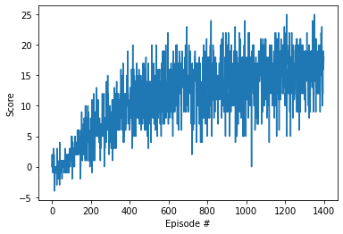

# Project 1: Navigation

Implemented DQN based action using the code provided in the lessons. Only interaction with the training environment is changed from gym to Unity. Following is the result of the training after 1400 episodes. Agent was able to reach avarege score of 16.

Following is the screen capture of the training agent

# Learning from Pixels

I have implemented Pixel based DQN. The implentation is in Navigation_Pixels.ipynb

A model spesic to the pixel based navigation is implemented in model_pix.py.

The report of the project is available in 